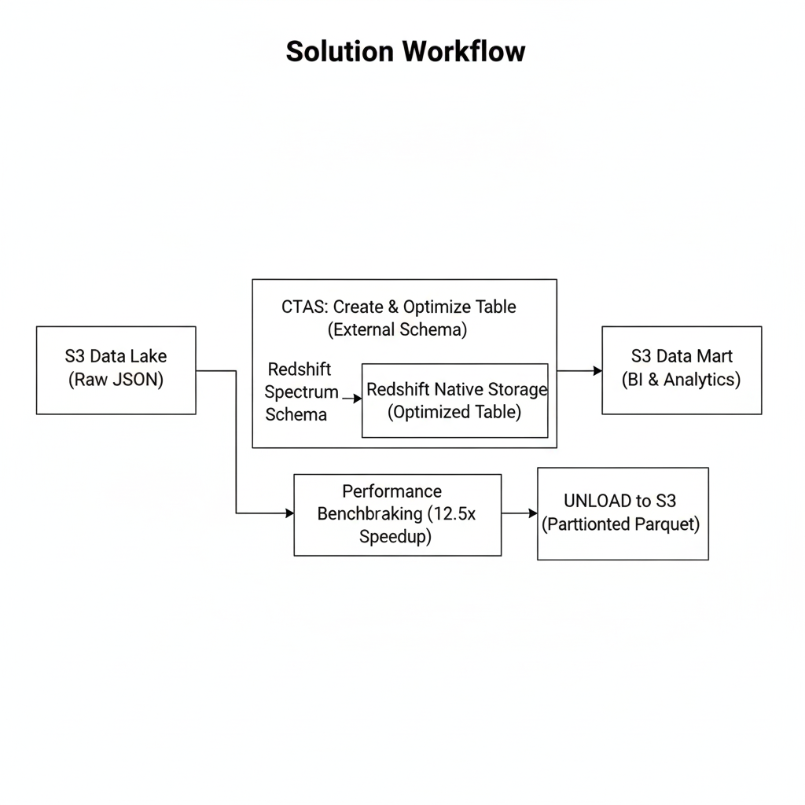

# Hybrid Cloud Data Warehouse: Optimizing 30M Records with Amazon Redshift

## Problem Statement
In modern data architectures, organizations face a critical trade-off between the low cost of **Data Lakes** (S3) and the high performance of **Data Warehouses** (Redshift). This project addresses the challenge of managing a large-scale dataset consisting of 30 million rows of JSON order data. The goal was to implement a hybrid storage strategy, comparing the performance of querying "cold" data directly from S3 via Redshift Spectrum versus "hot" data optimized within native Redshift storage.

## Solution Approach
This project implements a multi-tier storage architecture to balance cost and performance through a step-by-step engineering workflow.

### Step 1: External Data Access (Redshift Spectrum)
Instead of a traditional "load-everything" approach, I first implemented **Redshift Spectrum**. This allowed for querying raw NDJSON files stored in S3 without moving them into the warehouse.
* **Implementation**: Utilized AWS Glue Data Catalog and External Schemas to map the S3 data.
* **Benefit**: Provided immediate access to a 30M row "cold" data tier with zero internal storage costs.

### Step 2: Native Storage Optimization (CTAS)
To handle frequently accessed "hot" data, I migrated the dataset into native Redshift storage using the **CTAS (Create Table As Select)** pattern. 
* **Compound Sort Keys**: Implemented a sort key on `(ts, category, region)` to enable **Zone Map Pruning**, allowing the query engine to skip irrelevant data blocks.
* **Distribution Strategy**: Used `DISTSTYLE AUTO` to let the Redshift optimizer manage data placement across cluster nodes.
* **Storage Results**: Optimized the storage footprint to **2332 MB** using columnar compression.

### Step 3: Performance Benchmarking & Analysis
I conducted a comparative analysis between the S3-based Spectrum tables and the native optimized tables using the **Redshift Data API**.
* **Benchmarking**: Captured **EXPLAIN plans**, execution timings, and storage footprints for complex analytical queries.
* **Results**: Native storage provided a significant performance boost, achieving a **12.5x speedup** on selective time-filter queries compared to Spectrum.

### Step 4: Data Export & Interoperability (UNLOAD)
To support downstream BI dashboards and cross-tool interoperability, I implemented a data export pattern using the **UNLOAD** command.
* **Aggregation**: Summarized 30M rows into approximately **4,380 daily records**.
* **Partitioning**: Exported data to S3 in **Parquet** format, partitioned by a custom `revenue_flag` (high, normal, low) to enable efficient partition pruning for future analytics.

## Technical Stack
* **Cloud Infrastructure**: AWS (Redshift Provisioned, S3, Glue, CloudFormation).
* **Languages & SDKs**: SQL, Python, Boto3 (Redshift Data API).
* **Data Formats**: NDJSON (Source), Parquet (Export).
